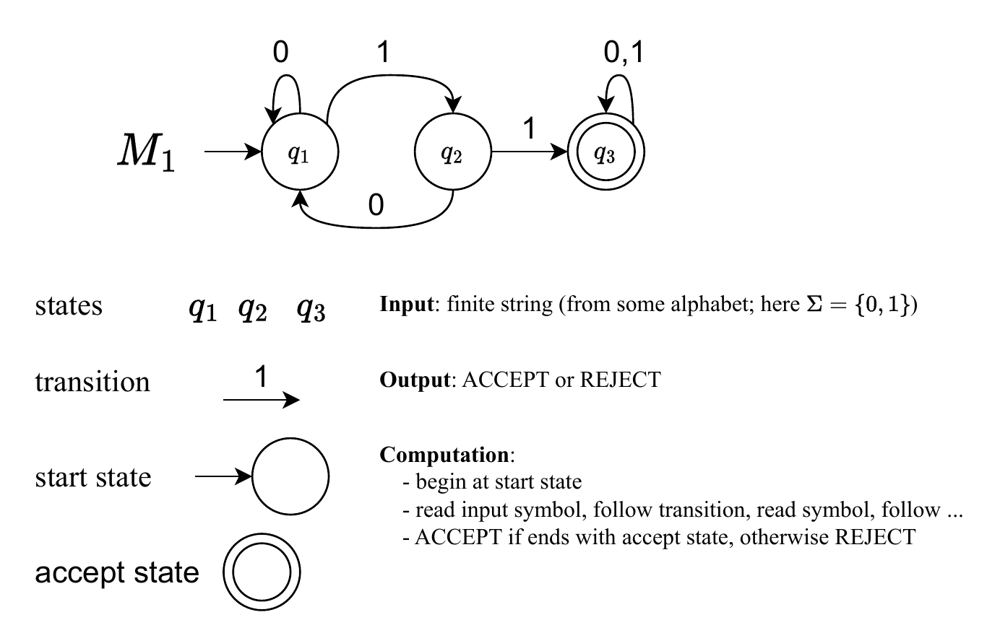

# Deterministic_Finite_Automaton

Python implementation of DFA:
https://en.wikipedia.org/wiki/Deterministic_finite_automaton

User can define its own alphabet and the automaton structure.
Program includes simulation: user inputs a word into terminal and the program outputs `ACCEPT` or `REJECT`,
upon finishing or rejecting state, respectively. Program shows the sequence of states automaton move to during the processing of the input word.

By default the code realize the following automaton:

The automaton recognizes all strings containing `11` substring.

## What I have learnt?

  * how DFAs work
  * using dictionaries
  * translate mathematical definition of DFAinto a computer program
  * writing readable code
