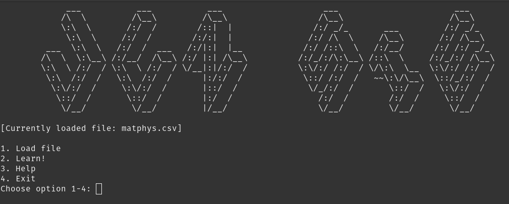

# JustLearn!

Program that help with self-studying and reviwing the material.
Easy to use!

## What I have learnt?

  * how to implement a menu
  * how to use classes to separate functionalities of the program
  * how to process text files, including CSV format
